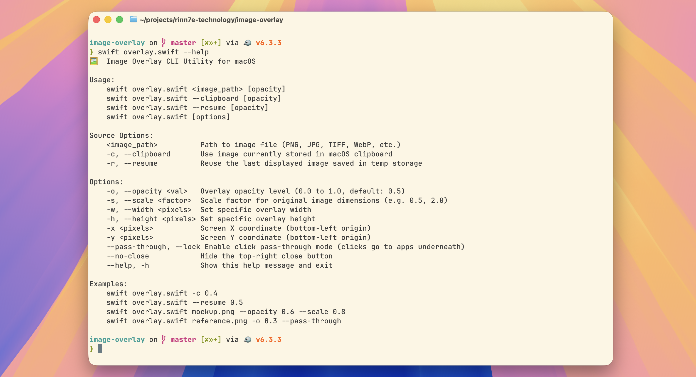

# Image Overlay CLI



A lightweight, zero-dependency macOS CLI utility that displays a floating, semi-transparent image overlay on top of all windows.

## Main Workflow

Copy an image or screenshot (`Cmd+Shift+Ctrl+4`) and run:

```bash
# 1. Overlay image from clipboard
swift overlay.swift --clipboard 0.5

# 2. Resume the last used overlay image
swift overlay.swift --resume
```

## Advanced Usage

```bash
# Overlay an image file directly
swift overlay.swift /path/to/image.png 0.5
```

```text
Usage:
    swift overlay.swift <image_path> [opacity]
    swift overlay.swift --clipboard [opacity]
    swift overlay.swift --resume [opacity]
    swift overlay.swift [options]

Source Options:
    <image_path>          Path to image file (PNG, JPG, TIFF, WebP, etc.)
    -c, --clipboard       Use image stored in macOS clipboard
    -r, --resume          Reuse the last displayed image saved in temp storage

Options:
    -o, --opacity <val>   Overlay opacity level (0.0 to 1.0, default: 0.5)
    -s, --scale <factor>  Scale factor for original dimensions (e.g. 0.5, 2.0)
    -w, --width <pixels>  Set specific overlay width
    -h, --height <pixels> Set specific overlay height
    -x <pixels>           Screen X coordinate (bottom-left origin)
    -y <pixels>           Screen Y coordinate (bottom-left origin)
    --pass-through, --lock Enable click pass-through mode
    --no-close            Hide top-right close button
    --help, -h            Show help message
```

## Features

- **Clipboard Support**: Display images directly from your clipboard (`-c`, `--clipboard`).
- **Resume Last Image**: Re-open the last displayed image (`-r`, `--resume`).
- **Click & Drag**: Move the overlay window anywhere on your screen.
- **Click Pass-Through**: Pass mouse clicks straight to underlying windows (`--pass-through`).
- **Customizable**: Adjust opacity, scale factor, dimensions, and positioning.

## License

[MIT License](LICENSE). See [CHANGELOG.md](CHANGELOG.md) for version history.
