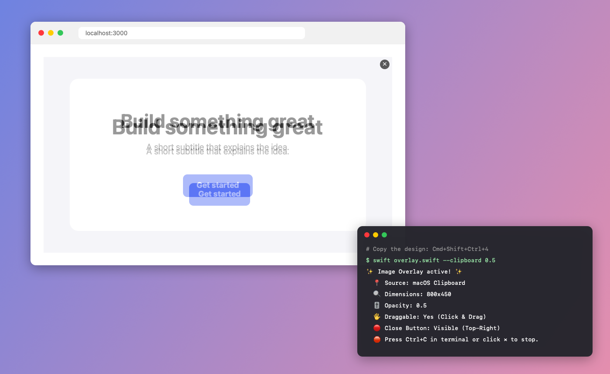
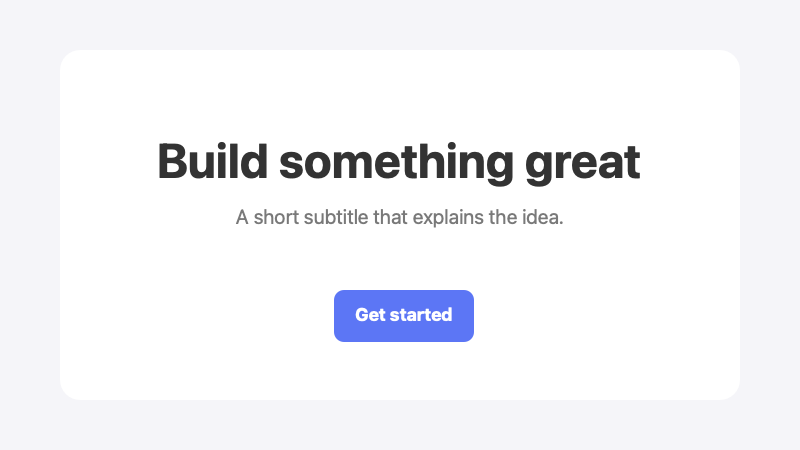
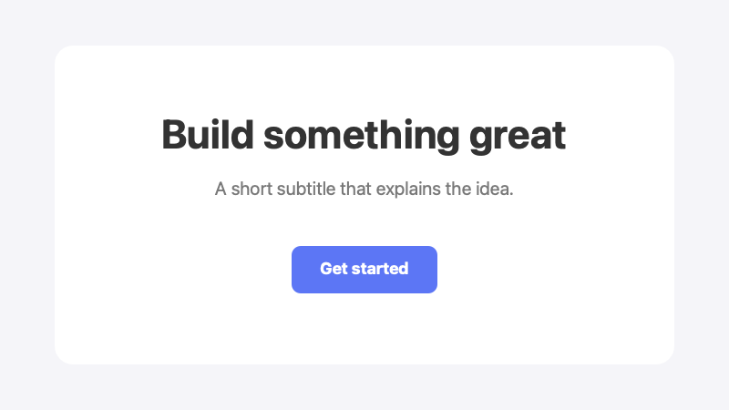
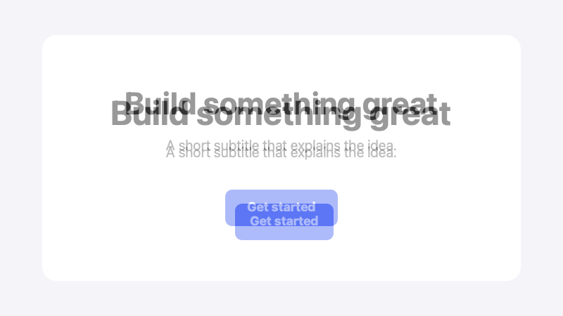

# Image Overlay CLI

[](AI-DECLARATION.md)


A lightweight, zero-dependency macOS CLI utility that displays a floating, semi-transparent image overlay on top of all windows.

## Requirements

- macOS (tested on macOS 26 with Swift 6.3)
- Xcode Command Line Tools, for the `swift` command: `xcode-select --install`

## Faster Startup (Optional)

`swift overlay.swift` compiles the script on every run, which takes a few seconds. Compile it once to start instantly:

```bash
swiftc -O overlay.swift -o image-overlay
./image-overlay --clipboard 0.5
```

## Main Workflow

Copy an image or screenshot (`Cmd+Shift+Ctrl+4`) and run:

```bash
# 1. Overlay image from clipboard
swift overlay.swift --clipboard 0.5

# 2. Resume the last used overlay image
swift overlay.swift --resume
```



The overlay floats above every window. Drag it to line it up with the page underneath, then click ✕ (or press Ctrl+C in the terminal) to close it. Anything that doesn't match shows up as a "ghost" double image. (Illustration.)

## Advanced Usage

```bash
# Overlay an image file directly
swift overlay.swift /path/to/image.png 0.5

# Compose two images into a new PNG (overlay top-aligned, horizontally centered)
swift overlay.swift --compose base.png overlay.png 0.5 --out result.png
```

Keep screenshots and generated images in `out/` (git-ignored), e.g. `out/<project>/`.

### Compose Mode Example

Compare a screenshot of your implementation with the design export. Wherever they differ, you see a "ghost" double image:

```bash
swift overlay.swift --compose doc/compose/website.png doc/compose/design.png 0.5 --out doc/compose/result.png
```

| Base: `website.png` | Overlay: `design.png` | Result: `result.png` |
|---|---|---|
|  |  |  |

In the result, the title is larger and lower than in the design, and the button is narrower and further down. If both images were identical, the result would look like a single crisp image.

The overlay is drawn top-aligned and horizontally centered, at the given opacity. The output always has the size of the base image. For a 2x (Retina) screenshot compared with a 1x design export, add `-s 2` to scale the overlay.

```text
Usage:
    swift overlay.swift <image_path> [opacity]
    swift overlay.swift --clipboard [opacity]
    swift overlay.swift --resume [opacity]
    swift overlay.swift --compose <base_path> <overlay_path> [opacity] [--out <path>]
    swift overlay.swift [options]

Source Options:
    <image_path>          Path to image file (PNG, JPG, TIFF, WebP, etc.)
    -c, --clipboard       Use image stored in macOS clipboard
    -r, --resume          Reuse the last displayed image saved in temp storage

Compose Mode (no window, writes a PNG):
    --compose             Draw overlay onto base (top-aligned, horizontally centered)
    --out <path>          Output file (default: <base_name>-overlay.png next to base)
                          Output matches the base size; -o and -s/-w/-H apply to the overlay

Options:
    -o, --opacity <val>   Overlay opacity level (0.0 to 1.0, default: 0.5)
    -s, --scale <factor>  Scale factor for original dimensions (e.g. 0.5, 2.0)
    -w, --width <pixels>  Set specific overlay width
    -H, --height <pixels> Set specific overlay height
    -x <pixels>           Screen X coordinate (bottom-left origin)
    -y <pixels>           Screen Y coordinate (bottom-left origin)
    --pass-through, --lock Enable click pass-through mode
    --no-close            Hide top-right close button
    --help, -h            Show help message
```

## Features

- **Clipboard Support**: Display images directly from your clipboard (`-c`, `--clipboard`).
- **Resume Last Image**: Re-open the last displayed image (`-r`, `--resume`).
- **Click & Drag**: Move the overlay window anywhere on your screen.
- **Click Pass-Through**: Pass mouse clicks straight to underlying windows (`--pass-through`).
- **Customizable**: Adjust opacity, scale factor, dimensions, and positioning.
- **Compose Mode**: Write a PNG of one image overlaid on another (top-aligned, horizontally centered), e.g. to compare a design export with a page screenshot (`--compose`).

## AI declaration

This project declares its AI usage in [AI-DECLARATION.md](AI-DECLARATION.md), following the
[AI-DECLARATION.md](https://ai-declaration.md) standard (level: `assist`).

## License

[MIT License](LICENSE). See [CHANGELOG.md](CHANGELOG.md) for version history.
